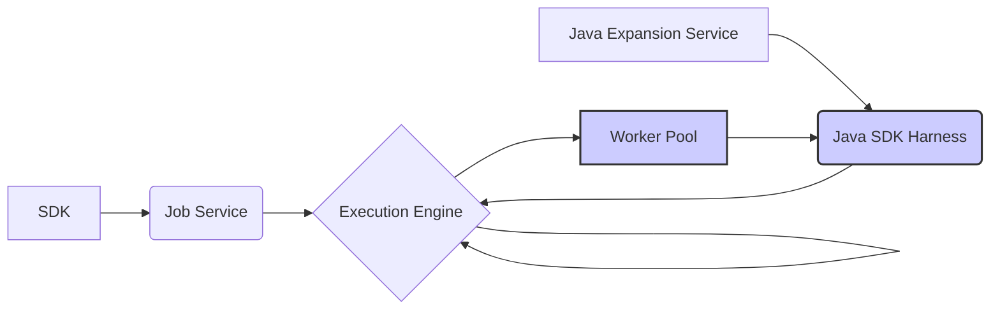

# beam-ml-flink

A Beam ML pipeline example using Apache Beam with Flink Runner for image classification tasks. This project adapts code from the [Google Dataflow ML Starter](https://github.com/google/dataflow-ml-starter) repository.

## Prerequisites

* Python 3
* Linux OS (Flink portable runner tests are not compatible with macOS or Windows)
* Docker (required for Portable Runner with Flink)

## Quick Start

```bash
# Install dependencies
make init

# Run unit tests
make test
```

## Pipeline Execution Options

### Local Runners

1. **Direct Runner** (simplest option)
```bash
make run-direct
```

2. **Prism Runner**
```bash
make run-prism
```

3. **Flink Runner with LOOPBACK**
```bash
make run-flink
```
> Note: Uses optimized Flink configurations from `data/flink-conf.yaml`

### Local Portable Runners (Linux Only)

4. **Portable Runner with Flink**
```bash
make run-portable-flink
```

5. **Portable Runner with Local Flink Cluster**

```bash
make run-portable-flink-local
```
> Note: Uses optimized Flink configurations from `data/flink-conf-local.yaml`

For the local Flink cluster setup:
1. Download Apache Flink from the [official website](https://flink.apache.org/downloads/)
2. Set `FLINK_LOCATION` to your Flink installation path
3. The above command will:
   - Copy optimized configurations from `data/flink-conf-local.yaml`
   - Start a Flink cluster (logs available in `$FLINK_LOCATION/log`)
   - Execute the Beam job
   - Stop the cluster automatically

## Service Ports

| Service | Port |
|---------|------|
| Artifact Staging Service | 8098 |
| Java Expansion Service | 8097 |
| Job Service | 8099 |

## Configuration

Check `.env` file to customize environment settings.

## Servic Graph



Explanation of the Graph:

- The user writes a pipeline using a Beam SDK, which is submitted to the Job Service.
- The Job Service sends the pipeline to the execution engine (like Dataflow or Flink).
- If the pipeline includes cross-language transforms, then a Java Expansion Service will spin up a Java SDK harness for the transforms written in Java.
- The execution engine creates and manages the worker pool.
- The SDK harness is hosted by the worker pool and executes the transforms of the pipeline.
- The execution engine and worker pool communicate during the job execution.

## Additional Resources

* [Beam Flink Runner Documentation](https://beam.apache.org/documentation/runners/flink/)
* [Beam SDK Harness Configuration](https://beam.apache.org/documentation/runtime/sdk-harness-config/)
* [Another Beam Flink Repo](https://github.com/jaehyeon-kim/beam-demos/tree/master/beam-pipelines)
