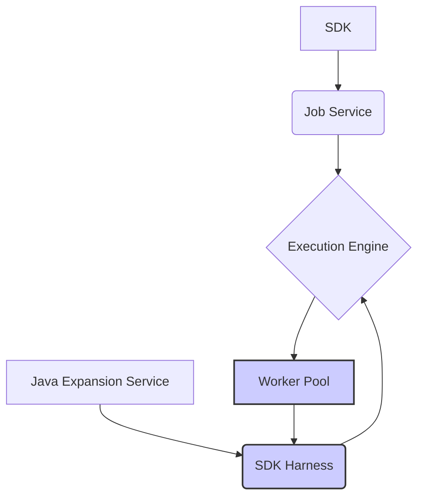

# beam-ml-flink

A Beam ML pipeline example using Apache Beam with Flink Runner for image classification tasks. This project adapts code from the [Google Dataflow ML Starter](https://github.com/google/dataflow-ml-starter) repository.

## Prerequisites

* Python 3
* Linux OS (Flink portable runner tests are not compatible with macOS or Windows)
* Docker (required for Portable Runner with Flink)

## Quick Start

```bash
# Install dependencies
make init

# Run unit tests
make test
```

## Pipeline Execution Options

### Local Runners

1. **Direct Runner** (simplest option)
```bash
make run-direct
```

2. **Prism Runner**
```bash
make run-prism
```

3. **Flink Runner with LOOPBACK**
```bash
make run-flink
```
> Note: Uses optimized Flink configurations from `data/flink-conf.yaml`

### Local Portable Runners (Linux Only)

4. **Portable Runner with Flink**
```bash
make run-portable-flink
```

5. **Portable Runner with Local Flink Cluster**

```bash
make run-portable-flink-local
```
> Note: Uses optimized Flink configurations from `data/flink-conf-local.yaml`

For the local Flink cluster setup:
1. Download Apache Flink from the [official website](https://flink.apache.org/downloads/)
2. Set `FLINK_LOCATION` to your Flink installation path
3. The above command will:
   - Copy optimized configurations from `data/flink-conf-local.yaml`
   - Start a Flink cluster (logs available in `$FLINK_LOCATION/log`)
   - Execute the Beam job
   - Stop the cluster automatically

6. **Portable Runner with Local Flink Cluster and DOCKER**

Using `EXTERNAL` introduces complexities in managing Python package dependencies across different environments compared to `LOOPBACK`. To mitigate this overhead, `DOCKER` is used here to build a local Python worker SDK Docker image containing the necessary packages:
```bash
make docker-cpu
```
This command builds a Pytorch CPU image with Beam, suitable for testing purposes.

Subsequently, a local Flink cluster can be launched to utilize this Python SDK image for model inference:
```bash
make run-portable-flink-worker-local
```
Note that:
* Shared Artifact Staging: The directory `/tmp/beam-artifact-staging` must be accessible to both the job server and the Flink cluster for sharing staging artifacts.
* Limitations: The pipeline operating within the Dockerized worker cannot directly access local image lists or write prediction results to the local filesystem. Consequently, testing is limited to scenarios like processing a single image file and printing the output within the worker environment.

However, this method is generally discouraged. For testing Beam pipelines, it is recommended to use `LOOPBACK` or local runners. For production deployments, utilize appropriate runners such as DataflowRunner or FlinkRunner with a managed Flink cluster (e.g., on Dataproc).

### Remote Dataproc Flink Cluster

This guide explains how to set up and use a Dataproc Flink cluster on Google Cloud Platform (GCP).

#### Prerequisites
- A Linux-based environment (recommended)
- GCP project with required permissions
- Configured `.env` file with your GCP Dataproc settings

#### Steps

1. Push the previous Docker image (created by `make docker-cpu`) to Artifact Registry (AR):
```bash
make push-docker-cpu
```

2. Create a Flink cluster on Dataproc:
```bash
make create-flink-cluster
```

3. Execute a Beam ML job on the cluster:
```bash
make run-portable-flink-cluster
```

4. Clean up by removing the cluster:
```bash
make remove-flink-cluster
```

**Note:** Before starting, ensure you've properly configured the `GCP DATAPROC SETTINGS` section in your `.env` file with your project-specific information.

### Remote Managed Flink Cluster

TODO.

### TODO
* Streaming
* GPU

## Service Ports

| Service | Port |
|---------|------|
| Artifact Staging Service | 8098 |
| Java Expansion Service | 8097 |
| Job Service | 8099 |
| Worker Pool Service | 5000 |

## Configuration

Check `.env` file to customize environment settings.

## Service Graph



Explanation of the Graph:

- The user writes a pipeline using a Beam SDK, which is submitted to the Job Service.
- The Job Service sends the pipeline to the execution engine (like Dataflow or Flink).
- If the pipeline includes cross-language transforms, then a Java Expansion Service will spin up a Java SDK harness for the transforms written in Java.
- The execution engine creates and manages the worker pool.
- The SDK harness is hosted by the worker pool and executes the transforms of the pipeline.
- The execution engine and worker pool communicate during the job execution.

## Additional Resources

* [Beam Flink Runner Documentation](https://beam.apache.org/documentation/runners/flink/)
* [Beam SDK Harness Configuration](https://beam.apache.org/documentation/runtime/sdk-harness-config/)
* [Another Beam Flink Repo](https://github.com/jaehyeon-kim/beam-demos/tree/master/beam-pipelines)
* [Dataproc](https://cloud.google.com/dataproc/docs/concepts/configuring-clusters/service-accounts)
